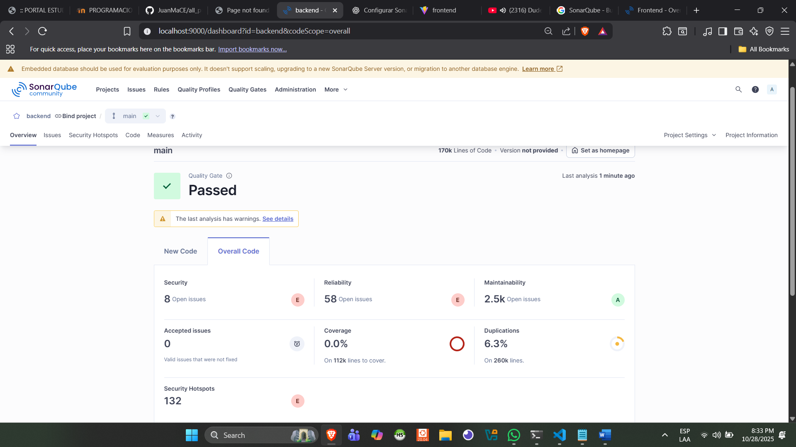
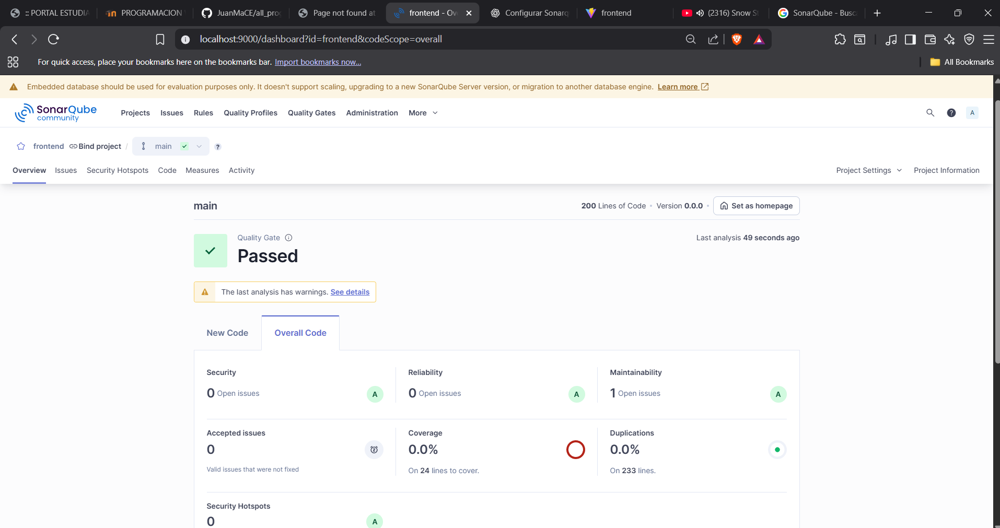

# Project Code Quality Report

This repository contains the code for the course project, along with results from code quality and security analysis using **SonarQube**.

---

## SonarQube Setup

The project was analyzed using a local SonarQube instance running via Docker.  
All backend (Python) and frontend (TypeScript/JavaScript) source code has been scanned for:

- Code quality issues
- Vulnerabilities
- Code smells
- Best practices

**Scanner used:** [SonarScanner](https://docs.sonarqube.org/latest/analysis/scan/sonarscanner/)  
**Backend token:** `sqp_4f7a17c47ac6f9be642f2cd8cdd4f2cfe4496333`  
**SonarQube URL:** [http://localhost:9000](http://localhost:9000)

---

## Backend Analysis

The backend is written in **Python**, analyzed with **Pylint** and **Bandit**.  

---

## Frontend Analysis

The frontend is written in **TypeScript / JavaScript**.  

