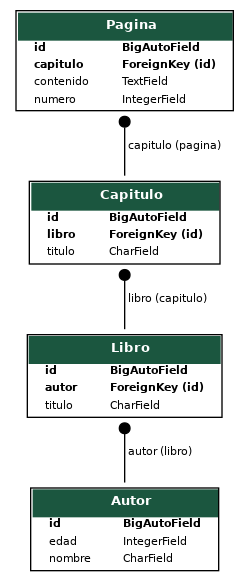

# Django Project - Migrations (Homework hw-05)

This project demonstrates the use of migrations in Django.

## Models and Relationships
- Author → Book → Chapter → Page

## Database Diagram

## Migrations
Each model was added in separate migrations:
- 0001: Author  
- 0002: Book  
- 0003: Chapter  
- 0004: Page  
